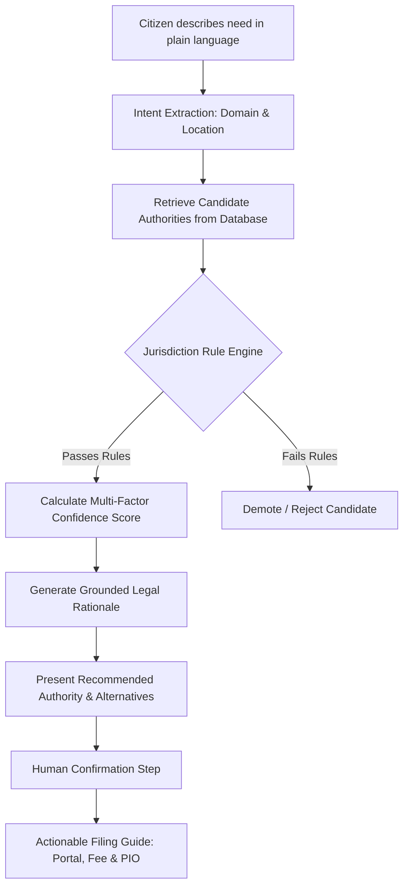

# Nyaya

### RTI Jurisdiction & Authority Discovery Assistant

Nyaya helps Indian citizens identify the correct Right to Information (RTI) public authority and filing portal from a plain-language description of their grievance before they submit an application to the wrong jurisdiction.

---

## 1. The Problem

Under India's constitutional framework (Seventh Schedule), government powers and administrative responsibilities are divided between the **Union (Central Government)**, **State Governments**, and **Local Bodies (Municipal Corporations and Panchayats)**. 

When citizens encounter a civic grievance (e.g. broken municipal road, incorrect state electricity bill, or delayed passport renewal), they often know what information they need, but do not know which administrative tier or public authority legally holds that information.

This leads to a pervasive failure mode in RTI filing:
1. **Wrong Portal Selection:** Citizens file applications on the Central portal (`rtionline.gov.in`) for state or municipal subjects, or vice versa.
2. **Transfer Friction:** Although Section 6(3) of the RTI Act provides for transfer of applications, Department of Personnel and Training (DoPT) circulars and administrative practice treat Central-to-State and State-to-Central transfers as discretionary rather than mandatory.
3. **Rejections & Delays:** Misfiled applications are frequently returned or rejected after 30+ days without a refund, forcing citizens to start over.

---

## 2. The Solution

Nyaya translates an informal citizen request into an exact, verified public authority record and actionable filing guide.

```
Citizen Query ("Why hasn't my street in Pune been repaired?")
    ↓
[AI Intent Engine] ───────► Extracts subject domain ('roads'), location ('Pune, MH'), and level hint
    ↓ (fails gracefully → keyword fallback)
[Knowledge Base Search] ──► Retrieves candidate authorities from curated database
    ↓
[Jurisdiction Rule Engine] ► DETERMINISTIC VETO (Safety Guardrail):
                            ├── Geographic containment check (Pune ⊆ Maharashtra)
                            ├── Subject domain verification (Roads ⊆ Municipal Services)
                            ├── Data integrity & consistency validation
                            ├── Concurrent List conflict detection
                            └── Section 6(3) transfer eligibility check
    ↓
[Confidence Engine] ──────► Computes structured score (HIGH / MEDIUM / LOW / NONE)
    ↓
[Grounded Explainer] ─────► Plain-language reasoning citing official source document
    ↓
[Human Confirmation Gate] ► Citizen explicitly reviews and confirms recommendation
    ↓
[Filing Route Resolver] ──► Verified official portal URL, fee (₹10), designated PIO, and 30-day tracking
```

---

## 3. Why Nyaya is Not "Just a Chatbot"

Nyaya does not ask a Large Language Model to invent or guess an authority name. 

| Layer | Responsibility | What It Does NOT Do |
|---|---|---|
| **AI (LLM)** | Natural language parsing & grounded explanation | Does **not** invent public authority names, does **not** decide jurisdiction rules, and does **not** generate unverified fees. |
| **Knowledge Base** | Structured, verified database rows of real authorities | Does **not** contain unverified or hypothetical data. |
| **Rule Engine** | Deterministic code rules enforcing constitutional & geographic boundaries | Does **not** use probabilistic AI logic. Operates as a strict gatekeeper. |
| **Human Gate** | Explicit citizen confirmation | The system never automatically submits filings on behalf of citizens. |

**The Safety Principle:** *AI suggests intent → Structured retrieval provides candidates → Deterministic rules validate jurisdiction → Curated sources provide evidence → Citizen confirms.*

---

## 4. Core User Journey



### Stage Summary

| Stage | Input | System Action | Output |
|---|---|---|---|
| **1. Information Need** | Free text + optional location | Accepts natural phrasing (Hindi/English mix supported) | Sanitized query string |
| **2. Review / Parse** | Raw query | AI/Keyword extraction of subject domain & state/city | Structured summary card |
| **3. Jurisdiction Discovery** | Parsed domain + location | SQL lookup filtered through deterministic Rule Engine | Ranked candidate records |
| **4. Grounded Reasoning** | Matched authority record | Explains match based strictly on source document & constitutional entry | "Why this authority?" panel |
| **5. Confirmation Gate** | Citizen review | Human confirms authority matches intent | Confirmation event logged |
| **6. Filing Route** | Confirmed authority | Displays official portal URL, ₹10 fee, PIO rank, and 30-day timeline | Actionable hand-off to official portal |

---

## 5. Core Features

| Feature | Description | Engineering Implementation |
|---|---|---|
| **Natural-Language Intent Extraction** | Converts colloquial problem descriptions into structured subject domains and location entities. | Anthropic Claude API via AI Gateway (with prompt injection isolation). |
| **Deterministic Rule Engine** | Enforces geographic containment, subject domain consistency, and transfer rules in code. | Pure TypeScript module (`src/modules/jurisdiction-rule-engine/`). Zero external dependencies. |
| **Adversarial Demotion (Flow D)** | Demotes AI-suggested candidates if they violate jurisdiction rules (e.g. a State body suggested for a Central query). | Unit-tested veto logic in `validateCandidate()`. |
| **Concurrent List Honesty Beat** | Surfaces dual authorities (Central MoE + State Education Dept) with an explicit explanation when a topic is on the Concurrent List (Entry 25). | `detectConcurrentConflict()` rule. |
| **Multi-Factor Confidence Scoring** | Evaluates rule validation, source tier (Official vs Expert), and data freshness (<180 days) to output `HIGH`, `MEDIUM`, `LOW`, or `NONE`. | Weighted scoring engine in `src/modules/confidence-engine/`. |
| **Grounded Explanations** | Generates reasoning restricted solely to facts present in the verified database record. | Restricted LLM prompt using authority record context only. |
| **Keyword Fallback Resilience** | If the AI provider is unavailable or times out, the system automatically falls back to keyword matching without crashing. | `AIUnavailableError` catch-block in `/api/query/:id/analyze`. |
| **Civic Trust UI/UX** | Follows the *Civic Trust & Clarity* design system (warm cream surface `#fff8f4`, Golden Ochre `#875200`, Public Sans + Atkinson Hyperlegible). | Pure Vanilla CSS design tokens with high contrast and full ARIA accessibility. |

---

## 6. Architecture

```
┌──────────────────────────────────────────────────────────────────┐
│                    Frontend (React + Vite)                       │
│  - App.tsx (State Machine & 5-Step Citizen Journey)              │
│  - Design System: Civic Trust & Clarity (Vanilla CSS)            │
│  - Public Sans & Atkinson Hyperlegible Typography                │
└────────────────────────────────┬─────────────────────────────────┘
                                 │ HTTP / JSON
┌────────────────────────────────▼─────────────────────────────────┐
│                 Backend API (Node.js + Express)                  │
│  - Security: Helmet, CORS, Express-Rate-Limit                    │
│  - Endpoints: /api/query, /api/authorities, /api/portals         │
└───────┬────────────────────────┬─────────────────────────┬───────┘
        │                        │                         │
┌───────▼─────────────┐ ┌────────▼──────────────┐ ┌────────▼───────┐
│     AI Gateway      │ │  Authority Discovery  │ │  Rule Engine   │
│ - Intent Extraction │ │ - Subject Domain SQL  │ │ - Deterministic│
│ - Grounded Explain  │ │ - Geographic Scope    │ │ - Pure Code    │
│ - Prompt Injection  │ │ - Confidence Engine   │ │ - Final Veto   │
│   Sanitization      │ │                       │ │   Power        │
└───────┬─────────────┘ └────────┬──────────────┘ └────────┬───────┘
        │                        │                         │
┌───────▼─────────────┐ ┌────────▼─────────────────────────▼───────┐
│ Anthropic API       │ │           SQLite Database (WAL)          │
│ (claude-sonnet-5)   │ │ - Curated Knowledge Base (7 Authorities) │
│ Configurable in env │ │ - Source Documents & Verification Dates  │
│                     │ │ - Application State & Audit Logs         │
└─────────────────────┘ └──────────────────────────────────────────┘
```

---

## 7. AI Architecture & Safety Boundary

### What AI Does
* Parses citizen text into structured domains (e.g. `roads`, `electricity`, `passport`, `education`).
* Extracts location names (e.g. `Pune`, `Maharashtra`).
* Formulates natural language explanations strictly grounded in the retrieved record.

### What AI Does NOT Do
* **Does NOT decide jurisdiction:** Jurisdiction is evaluated by code rules against constitutional and geographic scopes.
* **Does NOT invent authority names:** Candidates must exist in SQLite.
* **Does NOT generate fee schedules:** Fee amounts are read from database rows verified against official gazette notifications.

### Prompt Injection Defense
User queries are treated strictly as **data**, enclosed in isolated prompt boundaries. System instructions explicitly forbid executing user text as commands or modifying the authority catalog.

---

## 8. Data Model & Sourcing Discipline

All authority records in this repository are project-curated, source-backed records verified against primary government portals and gazettes. **This is a proof-of-concept dataset and not a complete government database.**

### Sourced & Verified Records (Proof of Concept)

| # | Authority | Level | Subject | Filing Portal | Verified Fee | Primary Source |
|---|---|---|---|---|---|---|
| 1 | **Pune Municipal Corporation (PMC)** | LOCAL | Roads, water, municipal tax | `rtionline.maharashtra.gov.in` | ₹10 | `pmc.gov.in` + MH RTI Rules 2026 |
| 2 | **MSEDCL (Mahavitaran)** | STATE | Electricity billing & supply | `rtionline.maharashtra.gov.in` | ₹10 | `mahadiscom.in` (RTI Section) |
| 3 | **Ministry of External Affairs (MEA) / RPO** | CENTRAL | Passports, consular matters | `rtionline.gov.in` | ₹10 | `rtionline.gov.in` directory |
| 4 | **Ministry of Education (MoE)** | CENTRAL | Central schemes, UGC, NCERT | `rtionline.gov.in` | ₹10 | Constitution List III Entry 25 |
| 5 | **School Education & Sports Dept (MH)** | STATE | State schools, local curriculum | `rtionline.maharashtra.gov.in` | ₹10 | Constitution List III Entry 25 |
| 6 | **Maharashtra Police** | STATE | Law & order, FIRs, complaints | `rtionline.maharashtra.gov.in` | ₹10 | Constitution List II Entry 2 |
| 7 | **Dept of Pension & Pensioners' Welfare** | CENTRAL | Central employee pensions | `rtionline.gov.in` | ₹10 | `pensionersportal.gov.in` |

> **Fee Verification Note:** Under the *Maharashtra Right to Information Rules, 2026* (July 7, 2026 notification, File No. GAD-12020/4/2025-GAD(DESK-6)), the application fee is ₹10. Central Government fee is ₹10 under the RTI Rules 2012.

---

## 9. Tech Stack

| Layer | Technology | Version / Specification | Role |
|---|---|---|---|
| **Frontend** | React, TypeScript, Vite | React 19, Vite 8, TypeScript 5.9 | Single-page application with accessible UI journey |
| **Styling** | Vanilla CSS | CSS Custom Properties | Implements *Civic Trust & Clarity* design system |
| **Backend** | Node.js, Express, TypeScript | Node v24, Express 4.21, `tsx` runner | REST API, orchestration, and validation pipeline |
| **Database** | SQLite via `better-sqlite3` | SQLite 3 in WAL mode | Embedded relational store for knowledge base & audit logs |
| **AI Model** | Anthropic Claude | `claude-sonnet-5` (configured via env) | Intent extraction & grounded explanation |
| **Testing** | Vitest | Vitest 4.1 | Unit testing for Rule Engine & pipeline logic |
| **Security** | Helmet, CORS, Express-Rate-Limit | 60 req / 15 min per IP | API protection and request throttling |

---

## 10. Project Structure

```text
├── backend/
│   ├── src/
│   │   ├── server.ts                       # Express app configuration & startup
│   │   ├── ai-gateway/
│   │   │   └── index.ts                    # Anthropic client wrapper & prompt guards
│   │   ├── api/
│   │   │   └── routes/
│   │   │       ├── query.ts                # /api/query (create, analyze, explain, confirm)
│   │   │       ├── authorities.ts          # /api/authorities (search & lookup)
│   │   │       ├── portals.ts              # /api/portals (portal directory)
│   │   │       └── feedback.ts             # /api/feedback (citizen feedback)
│   │   ├── db/
│   │   │   ├── connection.ts               # SQLite initialization & WAL mode
│   │   │   ├── schema/
│   │   │   │   └── 001_init.sql            # Knowledge Base & application schema
│   │   │   └── seed/
│   │   │       ├── authorities.json        # Curated verified authority records
│   │   │       └── run_seed.ts             # Database seeder script
│   │   └── modules/
│   │       ├── jurisdiction-rule-engine/   # SAFETY-CRITICAL deterministic validator
│   │       ├── authority-discovery/        # SQL retrieval & candidate ranking
│   │       └── confidence-engine/          # Multi-factor confidence scoring
│   ├── tests/
│   │   └── unit/
│   │       └── jurisdiction-rule-engine.test.ts # 24 unit tests including Flow D
│   ├── package.json
│   ├── tsconfig.json
│   └── vitest.config.ts
│
├── frontend/
│   ├── src/
│   │   ├── App.tsx                         # 5-step citizen flow & landing page
│   │   ├── main.tsx                        # React DOM root
│   │   ├── index.css                       # Civic Trust design system (DESIGN.md)
│   │   ├── api-client/
│   │   │   └── index.ts                    # Typed API fetch client
│   │   ├── components/
│   │   │   ├── AuthorityCard.tsx           # Authority recommendation card
│   │   │   ├── Badges.tsx                  # Confidence & Government level badges
│   │   │   ├── FAQAccordion.tsx            # Accessible civic FAQ accordion
│   │   │   ├── Header.tsx                  # Navigation header & brand emblem
│   │   │   ├── Footer.tsx                  # Trust notices & source links
│   │   │   └── InfoModals.tsx              # How It Works & About RTI views
│   │   └── hooks/
│   │       └── useRtiFlow.ts               # State machine managing query lifecycle
│   ├── package.json
│   ├── tsconfig.json
│   └── vite.config.ts
│
├── README.md                               # Project documentation
└── .env.example                            # Environment variable template
```

---

## 11. Quick Start / Local Development

### Prerequisites
* **Node.js:** v20.x or later (tested on v24.15.0)
* **npm:** v10.x or later

### 1. Backend Setup

```bash
# Navigate to backend directory
cd backend

# Install dependencies
npm install

# Configure environment variables
cp .env.example .env

# Start development server (auto-seeds database on first run)
npm run dev
```
The backend will be live at `http://localhost:3001`.

### 2. Frontend Setup

```bash
# In a separate terminal, navigate to frontend directory
cd frontend

# Install dependencies
npm install

# Start Vite development server
npm run dev
```
The frontend will be live at `http://localhost:5173`.

### 3. Run Automated Tests

```bash
cd backend
npm test
```

---

## 12. Environment Variables

Create a `.env` file in `backend/`:

```env
# Server Configuration
PORT=3001
FRONTEND_URL=http://localhost:5173

# AI Provider Configuration
# If not set, backend automatically operates in Keyword-Only Fallback Mode
ANTHROPIC_API_KEY=your_anthropic_api_key_here

# AI Model Identifier (Never hardcoded in application logic)
AI_MODEL_NAME=claude-sonnet-5

# Request Timeout (milliseconds)
AI_TIMEOUT_MS=12000

# Optional: Custom Database Path
# DATABASE_URL=./data/rti.db
```

In `frontend/.env`:

```env
VITE_API_URL=http://localhost:3001/api
```

---

## 13. API Specification

### `POST /api/query`
Initializes a new citizen query session.
* **Request:** `{"raw_text": "Why is my street broken in Pune?", "location_text": "Pune, Maharashtra"}`
* **Response (201):** `{"query_id": "uuid", "session_id": "uuid"}`

### `POST /api/query/:id/analyze`
Executes the full pipeline: Intent extraction → Authority discovery → Rule Engine validation → Confidence scoring.
* **Response (200):**
  ```json
  {
    "query_id": "uuid",
    "intent": {
      "subject_domain": "roads",
      "location_state_id": "MH",
      "location_city": "Pune",
      "government_level_hint": null
    },
    "ai_available": true,
    "keyword_fallback_used": false,
    "concurrent_conflict": false,
    "concurrent_explanation": null,
    "candidates": [
      {
        "authority_id": "auth_pmc",
        "name": "Pune Municipal Corporation",
        "government_level": "LOCAL",
        "fee_amount": 10,
        "portal_url": "https://rtionline.maharashtra.gov.in",
        "confidence": {
          "level": "HIGH",
          "score": 1.0,
          "reasons": ["All jurisdiction rules passed", "Sourced from official government portal"]
        }
      }
    ]
  }
  ```

### `GET /api/query/:id/explain?candidate=0`
Returns grounded reasoning for a candidate authority.
* **Response (200):**
  ```json
  {
    "query_id": "uuid",
    "candidate_id": "uuid",
    "explanation": "Pune Municipal Corporation is the correct local authority because municipal road repairs in Pune fall under the Maharashtra Municipal Corporations Act. File at https://rtionline.maharashtra.gov.in. Fee: ₹10."
  }
  ```

### `POST /api/query/:id/confirm`
Records citizen confirmation of an authority recommendation.
* **Request:** `{"candidate_id": "uuid"}`
* **Response (200):** `{"confirmed": true, "query_id": "uuid"}`

### `GET /api/health`
Health check endpoint.
* **Response (200):** `{"status": "ok", "timestamp": "ISO-8601", "version": "1.0.0"}`

---

## 14. What is Real vs Mocked

| Component | Status | Details |
|---|---|---|
| **Frontend UI/UX** | **REAL** | Full 5-step interactive citizen flow, accessibility tokens, responsive layout. |
| **Backend REST API** | **REAL** | Express server with rate limiting, error boundaries, and input validation. |
| **Rule Engine** | **REAL** | Pure deterministic validation logic with 24 passing unit tests. |
| **Database & Schema** | **REAL** | SQLite database with relational tables, foreign keys, and WAL mode. |
| **AI Integration** | **REAL** | Anthropic API integration via `ai-gateway` with automated keyword fallback. |
| **Authority Dataset** | **CURATED PROOF-OF-CONCEPT** | 7 manually-verified records sourced from official government gazettes & portals. (Not a full national directory). |
| **Government Portal Submission** | **NOT INTEGRATED** | Nyaya provides verified routing and links out to official portals (`rtionline.gov.in` / `rtionline.maharashtra.gov.in`). Nyaya does not submit forms directly. |
| **Payment Gateway** | **NOT INTEGRATED** | Citizens pay the ₹10 fee directly on the official government portal. |

---

## 15. Testing & Verification

The repository includes a comprehensive unit test suite covering all safety rules and edge cases.

```bash
$ cd backend && npm test

 ✓ tests/unit/jurisdiction-rule-engine.test.ts (24 tests) 8ms

 Test Files  1 passed (1)
      Tests  24 passed (24)
```

### Safety Tests Covered:
* **Flow D (Adversarial Demotion):** Verifies that if AI ranks an invalid State body first for a Central topic (e.g. Passport), the Rule Engine demotes it and selects MEA.
* **Geographic Containment:** Tests National, State, and City-level boundary containment.
* **Subject Match:** Tests exact domain matching vs adjacent and unrelated subjects.
* **Data Consistency:** Catches corrupt data (e.g. Central authorities having a state restriction).
* **Concurrent List Handling:** Verifies that dual subjects trigger the honesty banner rather than picking one arbitrarily.
* **Staleness Handling:** Verifies that records older than 180 days receive a staleness warning.

---

## 16. Current Limitations

1. **Curated Coverage Scope:** The Knowledge Base currently contains 7 high-depth proof-of-concept records covering Pune/Maharashtra and Central subjects. It does not yet cover all 28 Indian states or all ~4,000 urban local bodies.
2. **Designation-Level PIO Data:** Public Information Officers are stored at the designation rank (e.g., *Public Information Officer, Pune Municipal Corporation*) rather than individual names, as specific personnel change frequently.
3. **No Direct Submission:** Nyaya serves as a discovery and preparation assistant. The actual RTI application must be filed by the citizen on the official portal.

---

## 17. Roadmap

### Current (v1.0 - Day 1 MVP)
- [x] Deterministic Jurisdiction Rule Engine with Flow D adversarial defense
- [x] Multi-factor confidence scoring (HIGH / MEDIUM / LOW / NONE)
- [x] Sourced proof-of-concept dataset (Maharashtra + Central)
- [x] Civic Trust & Clarity design system (Public Sans + Atkinson Hyperlegible)
- [x] Keyword-only resilience fallback when AI is unavailable

### Next (v1.1)
- [ ] Expand curated Knowledge Base to 100+ high-volume public authorities across 5 major states (Karnataka, Tamil Nadu, Delhi, Uttar Pradesh, Gujarat).
- [ ] Multilingual support for Hindi, Marathi, and Tamil user queries.
- [ ] First Appeal guidance module for applications unanswered after 30 days.

### Future (v2.0)
- [ ] Automated verification crawler to detect changes in state RTI fee schedules and portal URLs.
- [ ] Offline-ready Progressive Web App (PWA) for low-connectivity rural users.

---

## 18. Contributing

Contributions are welcome. Please ensure all contributions maintain data integrity:

1. **Code Standards:** TypeScript strict mode required. All rules must be deterministically testable without external network calls.
2. **Authority Data Sourcing:** Any new authority record added to `authorities.json` **must** include a primary government source URL (`source_document_url`) and retrieval date (`retrieved_date`). Unreferenced records will be rejected.
3. **Test Suite:** Ensure all 24 unit tests pass (`npm test`) before opening a pull request.

---

## 19. License & Hackathon Context

Developed for **Build What Moves India 2026**.

Distributed under the **ISC License**. All public authority information is grounded in the public domain provisions of the Right to Information Act, 2005 (Government of India).
